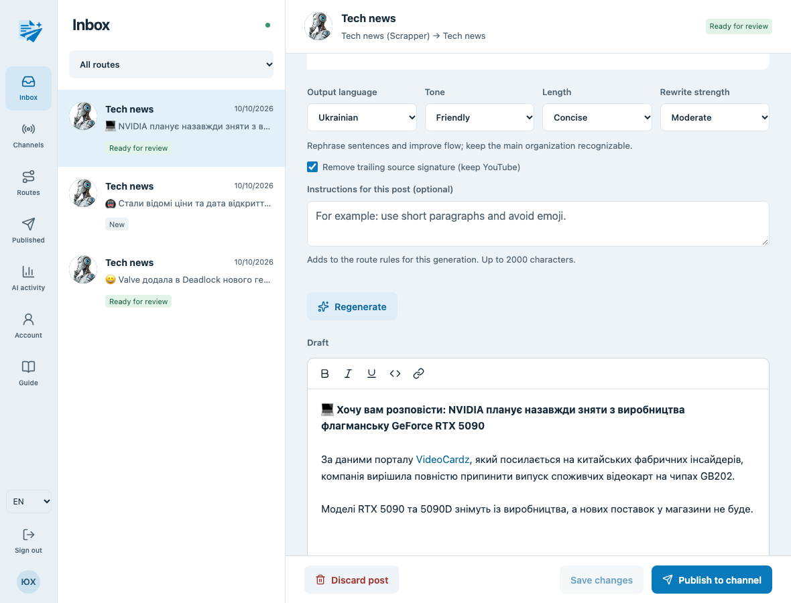
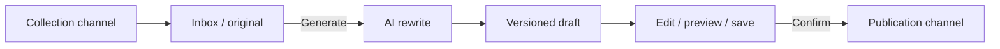
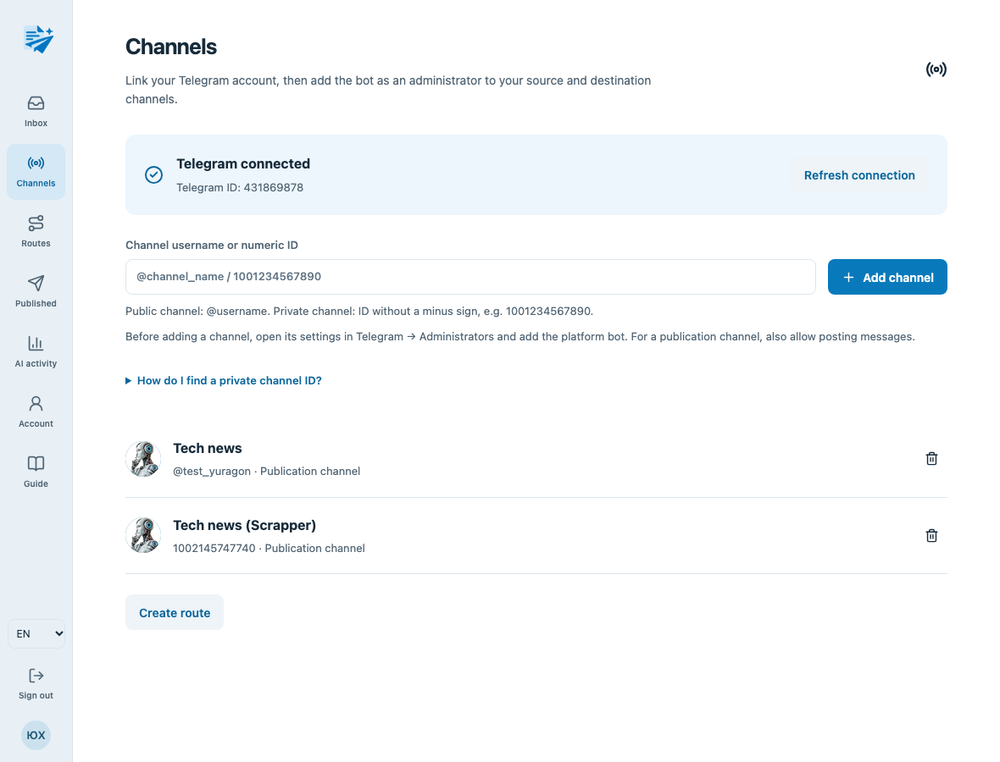
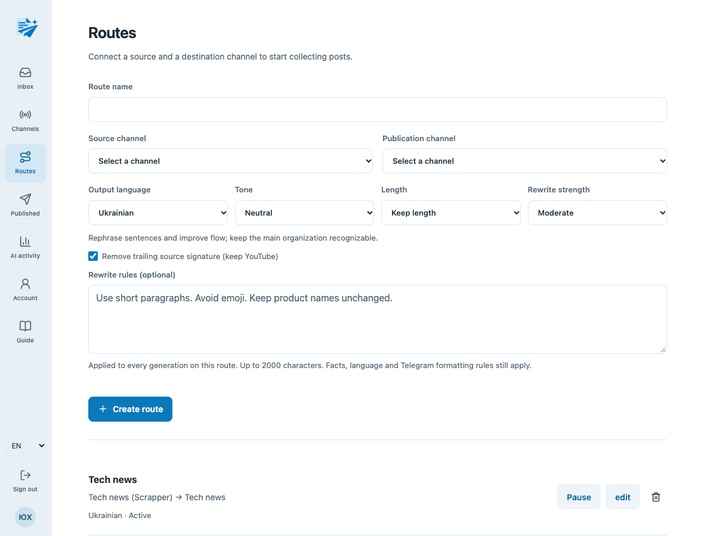

<p align="center">
  
</p>

<h1 align="center">TeleDraft AI</h1>

<p align="center">
  <strong>AI-powered drafts for your Telegram channels.</strong><br />
  Collect posts. Rewrite with AI. Review, edit and publish.
</p>

<p align="center">
  <a href="#screenshots">Screenshots</a> ·
  <a href="#the-ai-pipeline">AI pipeline</a> ·
  <a href="#getting-started">Getting started</a> ·
  <a href="#model--prompt-evals">Evals</a>
</p>

**TeleDraft AI** is a self-hosted, full-stack editorial workspace for Telegram channel owners. It turns incoming posts into AI-generated drafts tailored to your channel's style, with a rich text editor and a familiar Telegram-style preview. You choose what to generate and approve the saved version before the bot publishes it.

The AI layer uses **LangChain, OpenAI Responses API and Zod structured output**, with versioned prompts, configurable rewrite rules, execution metrics and a small live evaluation suite. The application combines a NestJS API, a React client, PostgreSQL persistence and Redis-backed background jobs.



## How it works

1. **Connect your Telegram account** and add the platform bot as an administrator to two channels you manage: a collection channel and a publication channel.
2. **Create a route** between them. Choose the output language, tone, length, rewrite strength and optional channel-specific writing rules.
3. **Forward or write a new post** in the collection channel. Text, photos, videos and albums appear in Inbox, with the original content preserved.
4. **Generate an AI draft.** Add optional instructions for this particular post, review the result, edit its wording or formatting, and save your changes.
5. **Confirm publication.** The bot sends the approved version and its media to the destination channel. Unwanted posts can be discarded instead.



The bot collects new posts from connected channels. To prepare content from another channel, forward it into your collection channel. The in-app **Guide** walks through the setup and permissions.

## Screenshots

**Connected channels**



**Routes and reusable rewrite rules**



## Features

- **AI editorial rewriting:** Ukrainian or English output, three tones, length controls and light, moderate or deep rewriting.
- **Your writing rules:** reusable instructions per route, plus optional instructions for a single generation. Compatible post-specific style instructions take precedence over route style rules.
- **Connected Telegram channels:** single-use account linking, administrator checks, public/private channels, dynamic routes, pause/resume and cycle prevention.
- **Persistent Inbox:** original text and media, photo/video support and albums of 2–10 items.
- **Draft workspace:** Telegram-compatible rich text, compact media galleries, preview, separate AI/manual revisions, version history and unsaved-change protection.
- **Reviewed publishing:** confirmation of a saved revision, publication history and recovery controls when Telegram delivery is uncertain. AI errors keep the post available for correction.
- **Accounts and access:** registration, login, profile/password updates, Argon2 password hashing, JWT authentication and owner-scoped data access.
- **Bilingual interface:** Ukrainian and English UI, independently selected from the AI output language; responsive desktop/mobile layouts.
- **AI visibility:** recorded model, prompt version, settings, outcome, token usage when available and response time, with a dedicated metrics page.

## The AI pipeline

One `AiService` creates the model and structured runnable once. Generation runs through the background queue; receiving a Telegram post does not call AI.

```text
Validated settings + versioned prompts + original post
  → LangChain / OpenAI Responses API
  → strict { html: string }
  → refusal / completion / schema / empty-output checks
  → versioned draft + execution metadata
  → human review + Telegram HTML / length validation
  → confirmed publication
```

### Prompts and controls

Prompts live in [`apps/api/src/ai/prompts/rewrite.ts`](apps/api/src/ai/prompts/rewrite.ts) and are shared by the application and eval runner.

- **System prompt:** editorial role, preservation of facts and a trust boundary around the incoming post.
- **Developer prompt:** validated rewrite settings, formatting/link rules, route instructions and post-specific instructions.
- **User message:** the original post, treated as content rather than instructions to execute.

| Control             | Options / behavior                                                                                        |
| ------------------- | --------------------------------------------------------------------------------------------------------- |
| Output language     | Ukrainian or English                                                                                      |
| Tone                | Neutral, formal or friendly                                                                               |
| Length              | Keep length or concise                                                                                    |
| Rewrite strength    | Light wording changes, moderate rephrasing or a deep rewrite of the opening and structure                 |
| Source signature    | Optionally remove the trailing source/channel signature; preserve YouTube signatures and meaningful links |
| Custom instructions | Route rules and per-post instructions, each limited to 2000 characters                                    |

Rewriting applies even when the post already uses the target language. Prompts require preservation of material facts, names, dates, numbers and meaningful links. Custom rules operate within these constraints; they cannot replace the response contract or change roles.

### Structured output and reliability

The model returns only **`{ html: string }`**, defined by a strict Zod schema through LangChain's `withStructuredOutput()` with `method: "jsonSchema"`, `strict: true` and `includeRaw: true`.

[`AiService`](apps/api/src/ai/ai.service.ts) checks refusals, incomplete generation, invalid schemas and empty results. The default model is `gpt-6-luna`, configurable through `LLM_MODEL`; it uses the Responses API with low reasoning effort, a 30-second request timeout and up to two retries for transient transport/provider failures. Refused or invalid content is not regenerated automatically.

Each run records the prompt version, settings, model, duration, available token usage and outcome. Application logs contain execution metadata without full post text or API keys. AI and manual revisions remain separate, so editing does not overwrite the generated version.

Structured output guarantees the response shape, **not factual accuracy or valid Telegram markup**. The server validates HTML and length before saving/publishing, and browser previews are sanitized. Review the wording, facts and links before approving a draft. See [OpenAI Structured Outputs](https://developers.openai.com/api/docs/guides/structured-outputs).

## Model & prompt evals

The repository includes **12 focused live eval cases** in [`apps/api/src/evals/cases.ts`](apps/api/src/evals/cases.ts). They exercise the production `AiService` and its actual prompts against the configured model:

- Ukrainian/English rewriting and preservation of facts and numbers.
- Telegram HTML, meaningful links, source signatures and the YouTube exception.
- Requested emoji, route rules and post-specific overrides.
- Instructions embedded in the source post, deep rewriting and concise captions.

```sh
# Run all 12 cases against the real model
pnpm evals --budget-calls 12

# Run one targeted case
pnpm evals --case emoji --budget-calls 1

# Save a separate report for a candidate model or prompt version
LLM_MODEL=YOUR_MODEL pnpm evals --budget-calls 12 --out eval-reports/candidate.json
```

**Live evals make paid OpenAI requests and require an explicit call budget.** The budget counts generations; transport retries can add HTTP requests. The runner reads the root `.env`, honors environment overrides and uses only the AI configuration. PostgreSQL, Redis and Telegram are not needed.

JSON reports are written to `apps/api/eval-reports/`. They include inputs, outputs, resolved settings, prompts, prompt version, model, check failures, timing and available token usage. Failed checks produce a nonzero exit code; a provider failure stops the run and records incomplete execution.

Each case also has a **manual review question**. Compare reports from different prompt versions or models and read the outputs: automatic number/link/language checks cannot establish semantic accuracy or editorial quality. There is no LLM judge. Normal tests and CI use local stubs and make no paid calls. This separation follows [task-specific evaluation and human review](https://developers.openai.com/api/docs/guides/evaluation-best-practices).

## Tech stack

| Layer                | Technologies                                                                                       |
| -------------------- | -------------------------------------------------------------------------------------------------- |
| AI                   | LangChain, OpenAI Responses API, Zod structured output, versioned prompts, live eval runner        |
| API                  | TypeScript, NestJS, Telegraf, Passport/JWT, Argon2, OpenAPI/Scalar                                 |
| Data and jobs        | PostgreSQL 17, Prisma 7 with migrations, Redis 7, BullMQ                                           |
| Frontend             | React 19, Vite, Tailwind CSS, React Router, TanStack Query, i18next, Tiptap, Lucide                |
| Quality and delivery | Jest, Vitest, Playwright, ESLint, Prettier, Husky, GitHub Actions, Docker Compose, pnpm workspaces |

## Architecture

```text
apps/
  api/
    prisma/                  entity schemas, migrations and seed
    src/
      api/
        auth/, user/         authentication and profiles
        channels/            Telegram linking, channels and routes
        posts/               ingestion, revisions, operations and queue worker
      ai/                    AiService, options and versioned prompts
      evals/                 model/prompt cases and budgeted runner
      telegram/              Telegraf transport, polling and HTML utilities
      config/                Zod-validated environment
      infra/                 Prisma and Redis
  client/
    src/                     workspace, editor, settings and bilingual guide
    e2e/                     desktop/mobile browser tests
packages/shared/             shared package workspace

docs/
  assets/                    generated brand logo
  screenshots/               desktop product screenshots
```

## Getting started

### Requirements

- **Node.js 24+**, the pnpm version pinned in `package.json`, and Docker with Compose.
- A Telegram bot token and **two channels you administer**.
- An OpenAI API key with access to the configured model.

### Install and run

```sh
pnpm install
cp .env.sample .env
```

Edit `.env` before starting. Required secrets and key settings:

| Variable                    | Purpose                                                                |
| --------------------------- | ---------------------------------------------------------------------- |
| `TELEGRAM_BOT_API_TOKEN`    | Platform bot token, created through Telegram's `@BotFather`            |
| `OPENAI_API_KEY`            | Server-side OpenAI key for rewriting and live evals                    |
| `JWT_SECRET`                | Strong random signing secret; generate one with `openssl rand -hex 32` |
| `LLM_MODEL`                 | Optional model override; default: `gpt-6-luna`                         |
| `APP_URL`                   | Browser origin; default: `http://localhost:3001`                       |
| `DATABASE_URL`, `REDIS_URL` | Database and queue connections; local defaults are in `.env.sample`    |

Keep secrets in local `.env` files. For an existing installation, retain your current values rather than copying the sample over them. All ports, token lifetimes and optional seed settings are documented in [`.env.sample`](.env.sample).

```sh
pnpm db:up
pnpm db:generate
pnpm db:deploy
pnpm dev
```

| Service           | Local URL                          |
| ----------------- | ---------------------------------- |
| Application       | http://localhost:3001              |
| API documentation | http://localhost:3000/docs         |
| OpenAPI JSON      | http://localhost:3000/openapi.json |
| Readiness         | http://localhost:3000/api/health   |

### Connect Telegram

1. Open **Channels → Connect Telegram → Open the bot**, start the bot and refresh the connection on the site. The linking code is single-use and expires after 10 minutes.
2. In Telegram, add that bot as an **administrator to both channels**. Grant posting permission in the publication channel. Your linked Telegram account must also administer both channels.
3. Add public channels with `@username`. For a private channel, enter its numeric ID without the minus sign, for example `1001234567890`; signed IDs are accepted too.
4. Create an active source → destination route on **Routes** and set your rewrite defaults.
5. Forward a **new** post into the collection channel, then open **Inbox** to generate, edit and publish it.

To find a private channel ID, copy a post link: `https://t.me/c/1234567890/42`. Add `1000000000000` to the number after `/c/` and enter `1001234567890`. An invite link such as `t.me/+…` does not contain the channel ID. The Channels page includes these instructions.

## Commands

Run from the repository root:

| Command                            | Purpose                                                     |
| ---------------------------------- | ----------------------------------------------------------- |
| `pnpm dev`                         | Start API and client in watch mode                          |
| `pnpm dev:api` / `pnpm dev:client` | Start one application                                       |
| `pnpm build`                       | Generate Prisma client and build all workspace applications |
| `pnpm start:prod`                  | Start the built API; serves the client build in production  |
| `pnpm test`                        | Run API and client unit tests                               |
| `pnpm test:integration`            | Run API integration scenarios with isolated test services   |
| `pnpm test:e2e`                    | Run the full browser flow on desktop and mobile             |
| `pnpm typecheck`                   | Check API/client types, including API tests                 |
| `pnpm lint`                        | Check API/client lint rules                                 |
| `pnpm format`                      | Format supported repository files                           |
| `pnpm db:up` / `pnpm db:down`      | Start/stop local PostgreSQL and Redis                       |
| `pnpm db:generate`                 | Generate Prisma client                                      |
| `pnpm db:migrate`                  | Create/apply development migrations                         |
| `pnpm db:deploy`                   | Apply committed migrations                                  |
| `pnpm db:view`                     | Open Prisma Studio                                          |
| `pnpm db:seed`                     | Create the configured administrator                         |
| `pnpm evals --budget-calls 12`     | Evaluate the real model and prompts                         |

### Tests and CI

```sh
pnpm test
pnpm typecheck
pnpm lint
pnpm build
```

## License

[MIT](LICENSE) © 2026 Yurii Khvyshchuk.
